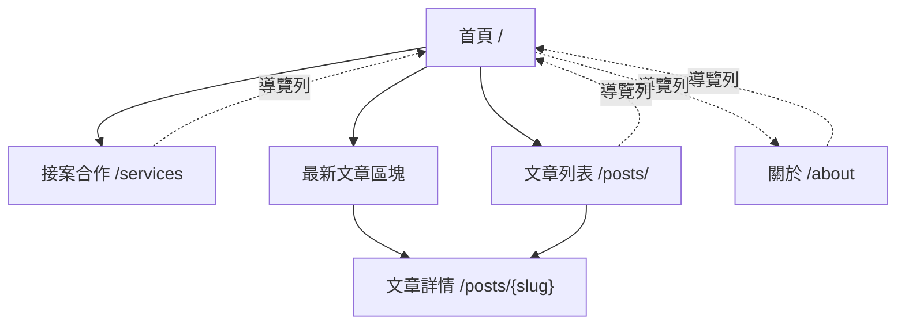

# Blog Core Spec

本文件記錄目前 Blog 專案的頁面結構、布局關係與排版風格。它描述的是現況規格，不是未來功能清單；後續新增頁面或調整樣式時，應優先與本文件保持一致。

## 1. 專案定位

本專案是一個以 VitePress 建立的個人技術網站，主要承載：

1. 個人首頁與合作入口。
2. 技術文章與文章列表。
3. 關於網站與建站紀錄。
4. 未來寫作題材規劃。

網站語系設定為繁體中文，站名為 `Robin`，描述為「Robin 的技術筆記、作品入口與個人介紹網站」。

## 2. 技術與資料邊界

- 框架：VitePress。
- 內容來源：`src/**/*.md`。
- 主題擴充：`src/.vitepress/theme/index.js`。
- 全站樣式：`src/.vitepress/theme/custom.css`。
- 文章資料載入：`src/.vitepress/theme/data/posts.data.mjs`。
- 文章列表元件：`src/.vitepress/theme/components/PostList.vue`。
- 靜態資源：
  - 全站 logo：`src/public/mark.svg`。
  - 關於頁圖片：`src/about-assets/*.jpg`。

`src/.vitepress/dist` 與 `src/.vitepress/cache` 屬於編譯或快取產物，不應作為內容或設計規格來源。

## 3. 全站資訊架構

### 3.1 導覽列

導覽列由 `src/.vitepress/config.mjs` 的 `themeConfig.nav` 定義，目前包含：

| 導覽文字 | 路由 | 對應檔案 | 用途 |
| --- | --- | --- | --- |
| 首頁 | `/` | `src/index.md` | 網站入口、個人定位、主要 CTA、最新文章 |
| 接案合作 | `/services` | `src/services.md` | 合作模式、適合案型、技術與工作方式 |
| 文章 | `/posts/` | `src/posts/index.md` | 所有文章列表與新文章撰寫說明 |
| 關於 | `/about` | `src/about.md` | 網站介紹與建站歷史紀錄 |

`/profile` 曾被規劃為履歷或個人介紹入口，但目前在導覽與首頁 CTA 中都被註解隱藏。

### 3.2 頁面關係



首頁是主要入口，承接「接案合作」與「文章列表」兩個主要流向。文章列表頁與首頁最新文章區塊都依賴同一個 `PostList` 元件與文章資料載入器。

## 4. 頁面布局規格

### 4.1 首頁

檔案：`src/index.md`

首頁使用 VitePress `layout: home`。版面由 VitePress Home Layout、Hero、Features 與一般 Markdown 區塊組成。

布局順序：

1. Hero
   - `name`: Robin。
   - `text`: 從心理學走進軟體工程。
   - `tagline`: 說明 C#、ASP.NET Core、Vue、SQL、FHIR 與產品思考。
   - 圖像使用 `/mark.svg`。
   - 主要 CTA：接案合作 `/services`。
   - 次要 CTA：文章列表 `/posts/`。
2. Features
   - 系統開發。
   - 單次交付。
   - 工程方法。
3. 接案方向
   - 用短段落說明目前合作方向。
   - 導向 `/services`。
4. 最新文章
   - 使用 `<PostList :limit="5" />`。
   - 最多顯示 5 篇文章。
   - 下方提供「查看所有文章」連結。
5. 網站整理方向
   - 以有序清單列出未來主要內容主題。

首頁的功能是「快速定位 Robin 是誰、可以合作什麼、可以讀什麼」，不應被大量長文內容稀釋。

### 4.2 接案合作頁

檔案：`src/services.md`

接案合作頁是目前最完整的服務型頁面，使用 Markdown 搭配自訂 HTML class 建立局部版型。

布局順序：

1. 頁面標題：`# 接案合作`。
2. Lead 段落：`service-lead`，放大並降低文字權重，用於說明合作形式。
3. 一般說明段落：界定非長期駐點維護模式。
4. 重點提示：`service-note`，左側品牌色邊框，用於凸顯適合場景。
5. 適合合作的案型：`service-grid`。
   - 兩欄卡片布局，窄螢幕改為單欄。
   - 每張 `service-card` 包含標題、描述與條列。
   - 目前四類：排課/排班工具、專案管理小系統、行政流程工具、報表與資料整理工具。
6. 主要技術：`service-tags`。
   - pill 樣式標籤，呈現技能與技術棧。
7. 工作方式：有序清單。
8. 不適合案型：無序清單。
9. 適合合作對象：無序清單。
10. 聯絡前準備資訊：有序清單。

此頁的內容密度比首頁高，但仍維持「短段落、條列、卡片」為主，不做複雜互動。

### 4.3 文章列表頁

檔案：`src/posts/index.md`

文章列表頁是所有文章的集中入口。

布局順序：

1. 頁面標題：`# 文章列表`。
2. 簡短說明段落。
3. `<PostList />` 顯示所有非草稿文章。
   - 列表上方提供搜尋框，可即時搜尋文章 `title`、`description`、`tags`。
   - 搜尋可與標籤篩選同時作用。
   - 無符合結果時顯示清楚空狀態。
4. 撰寫新文章方式。
   - 使用 Markdown 程式碼區塊示範 front matter。
   - 說明首頁與列表頁會自動讀取並排序文章。
   - 說明可透過 `tags` front matter 加上多個文章標籤。
   - 說明可透過 `series` 與 `seriesOrder` 建立同系列文章順序。

文章列表不手動維護文章連結，必須透過 `PostList` 與 `posts.data.mjs` 自動產生。
完整文章列表會在列表上方顯示所有文章標籤，點擊標籤後只顯示帶有該標籤的文章；再次點擊目前標籤或點擊「全部」會回到完整列表。
完整文章列表的搜尋範圍限於文章 metadata，不做 Markdown 全文搜尋或中文分詞。搜尋、標籤篩選與無結果狀態都由 `PostList` 在瀏覽器端即時處理，不需要重新整理頁面。

### 4.4 文章詳情頁

檔案範例：`src/posts/hello-vitepress.md`

每篇文章是 `src/posts/*.md` 的 Markdown 檔案。

必要 front matter：

```md
---
title: 文章標題
date: 2026-03-28
description: 文章摘要
tags:
  - C#
  - 測試
series: Clean Code
seriesOrder: 1
---
```

文章詳情頁使用 VitePress 預設 doc layout。內容結構建議：

1. `#` 作為文章主標題。
2. `##` 分段。
3. 條列內容優先使用有序或無序清單。
4. 如需從列表隱藏，加入 `draft: true`。
5. 如需分類，加入 `tags` 陣列；一篇文章可同時擁有多個標籤。
6. 如需建立系列文章，加入 `series` 與 `seriesOrder`。
7. 文章頁底部會依同系列的 `seriesOrder` 顯示上一篇與下一篇連結；沒有同系列、沒有上一篇或沒有下一篇時，不顯示空白或錯誤區塊。
8. 文章頁底部會自動顯示發布日期早於目前文章的最近 3 篇文章；少於 3 篇時顯示現有數量，沒有可顯示文章時不顯示該區塊。

文章會由 `posts.data.mjs` 依 `date` 由新到舊排序。缺少 `title` 的文章不會出現在列表中。
`date` 是文章發布日期與近期文章排序來源，不使用檔案建檔日期。

### 4.5 關於頁

檔案：`src/about.md`

關於頁目前不是個人履歷頁，而是網站介紹與建站歷程紀錄。

布局順序：

1. `# 關於這個網站`。
2. 說明網站是 VitePress 靜態 Blog MVP。
3. 用有序清單列出目前版本目標。
4. 用有序清單列出未來可能新增能力。
5. `## 歷史紀錄`。
6. 依日期使用 `###` 建立紀錄段落。
7. 透過相對路徑插入截圖，例如 `./about-assets/git.jpg`。
8. 搭配條列說明建站過程與檔案用途。

此頁允許較口語的紀錄文字，但圖片與清單仍應維持可讀性。

### 4.6 規劃頁

檔案：`src/plan.md`

規劃頁目前沒有放在導覽列，屬於內部或低曝光內容。內容以巢狀有序清單整理未來可能撰寫的主題，包括求解器、ATDD/DDD、心理學與軟體技術文章。

若未來要公開此頁，應先補上 front matter、頁面描述與導覽入口。

## 5. 文章資料與元件規格

### 5.1 PostList 元件

檔案：`src/.vitepress/theme/components/PostList.vue`

Props：

| Prop | 型別 | 預設 | 說明 |
| --- | --- | --- | --- |
| `limit` | Number | `0` | 大於 0 時只顯示前 N 篇文章 |
| `emptyText` | String | `目前還沒有文章。` | 沒有文章時顯示的文字 |

每張文章卡片包含：

1. 日期：`post-card-date`，使用 `Intl.DateTimeFormat('zh-TW')` 格式化。
2. 標題：`post-card-title`，連到文章 URL。
3. 摘要：`post-card-description`。
4. 標籤：`post-card-tags` / `post-card-tag`，顯示文章 `tags`。
5. 文字連結：`閱讀文章`。

當 `limit` 大於 0 時，`PostList` 只顯示前 N 篇文章，不顯示標籤篩選器；此模式用於首頁最新文章區塊。
當 `limit` 為 0 時，`PostList` 顯示完整文章列表、`post-search` 搜尋框與 `post-tag-filter` 標籤篩選器；此模式用於 `/posts/` 文章列表頁。
搜尋框會比對文章 `title`、`description`、`tags`，搜尋字串與標籤篩選同時成立時才顯示文章。

### 5.2 ArticleFooterLinks 元件

檔案：`src/.vitepress/theme/components/ArticleFooterLinks.vue`

此元件透過 VitePress theme layout 的 `doc-after` slot 掛載於文章詳情頁底部。若目前頁面不是有效文章，或沒有任何可顯示的關聯文章，元件不輸出內容。

同系列文章規則：

1. 只處理有 `series` 的文章。
2. 同一 `series` 的文章依 `seriesOrder` 由小到大排序。
3. `seriesOrder` 缺漏時排在有明確順序的文章後方，並以 `date` 作為次要排序。
4. 只顯示目前文章相鄰的上一篇與下一篇。

近期文章規則：

1. 以 front matter `date` 轉出的 `timestamp` 判斷。
2. 只顯示發布日期早於目前文章的文章。
3. 不包含目前文章本身。
4. 依日期由新到舊取最多 3 篇。

### 5.3 文章資料載入器

檔案：`src/.vitepress/theme/data/posts.data.mjs`

資料來源：`posts/*.md`。

轉換規則：

1. 排除 `/posts/` 列表頁本身。
2. 只保留有 `frontmatter.title` 的文章。
3. 排除 `frontmatter.draft` 為 truthy 的文章。
4. 輸出欄位：`title`、`url`、`date`、`description`、`tags`、`series`、`seriesOrder`、`timestamp`。
5. 依 `timestamp` 由新到舊排序。

`tags` 來源為 front matter：

```md
tags:
  - Test
  - 測試
```

建議使用陣列格式。若 `tags` 寫成逗號分隔字串，loader 會切分並去除空白；若未填寫，輸出空陣列。
`series` 來源為 front matter 字串；缺漏時輸出空字串。
`seriesOrder` 會轉為數字；無效或缺漏時輸出 `null`。

## 6. 視覺與排版風格

### 6.1 整體風格

目前風格是暖色系、紙張感、個人技術筆記與接案頁之間的折衷。Light Mode 與 Dark Mode 都使用同一套語意 token，實際色票集中在 `src/.vitepress/theme/custom.css` 檔案開頭。

- 卡片使用淡色漸層、細邊框與柔和陰影。
- 標題使用 serif 字體，內文使用 sans-serif 字體。
- 元件圓角偏大，常見為 `20px`、`24px`、pill 則為 `999px`。

### 6.2 色彩 token

主要色彩定義在 `custom.css` 的 `:root`。檔案開頭分為：

1. `Light Mode color palette`。
2. `Dark Mode color palette`。
3. `Active semantic colors: Light Mode default`。
4. `.dark` 內的 Dark Mode 語意色彩覆寫。

Light Mode 目前以米白、暖灰、淡橘棕為背景，品牌色為陶土紅與深棕。

| Token | 色值 | 用途 |
| --- | --- | --- |
| `--vp-c-brand-1` | `#b83b24` | 主品牌色、連結 hover、重點邊框 |
| `--vp-c-brand-2` | `#d55f3f` | 次品牌色 |
| `--vp-c-brand-3` | `#8d2818` | 深品牌色 |
| `--vp-c-brand-soft` | `rgba(184, 59, 36, 0.14)` | 淡品牌背景 |
| `--vp-c-bg` | `#f7f1e8` | 主背景 |
| `--vp-c-bg-alt` | `#efe3d3` | 次背景 |
| `--vp-c-bg-elv` | `#fffaf4` | 浮起區塊背景 |
| `--vp-c-text-1` | `#231815` | 主要文字 |
| `--vp-c-text-2` | `#5f4c45` | 次要文字 |

Dark Mode 目前以深棕黑背景與淺暖色文字為主：

| Token | 色值 | 用途 |
| --- | --- | --- |
| `--vp-c-brand-1` | `#ff9b7a` | 主品牌色、連結 hover、重點邊框 |
| `--vp-c-brand-2` | `#f47d58` | 次品牌色 |
| `--vp-c-brand-3` | `#ffb895` | 深色模式中的亮品牌輔色 |
| `--vp-c-bg` | `#211816` | 主背景 |
| `--vp-c-bg-alt` | `#2a201d` | 次背景 |
| `--vp-c-bg-elv` | `#322620` | 浮起區塊背景 |
| `--vp-c-text-1` | `#fff4e8` | 主要文字 |
| `--vp-c-text-2` | `#d8c4b8` | 次要文字 |

兩個模式的頁面背景都使用 radial gradient 與 vertical linear gradient。Light Mode 形成柔和紙張底色；Dark Mode 形成深色暖調背景，讓文字維持淺色可讀。

### 6.3 字體

字體由 Google Fonts 載入：

- 標題：`Fraunces`。
- 內文：`IBM Plex Sans`。
- monospace 目前也設定為 `IBM Plex Sans`。

套用規則：

- `.VPHero .name`、`.VPHero .text`、`.vp-doc h1/h2/h3` 使用 heading font。
- 一般段落、清單與導覽沿用 base font。

### 6.4 全站 VitePress 元件調整

| 選擇器 | 規格 |
| --- | --- |
| `.VPNavBar`, `.VPDoc`, `.VPFooter` | 使用 `backdrop-filter: saturate(140%) blur(6px)` |
| `.VPNavBar .content-body` | 半透明淺底、細邊框、pill 或 20px 圓角 |
| `.VPHero .text` | 最大寬度 `10ch`，寬螢幕形成短行大標 |
| `.VPHero .tagline` | 最大寬度 `40rem`，字級 `1.05rem` |
| `.VPFeature` | 淡色漸層卡片、細邊框、柔和陰影 |
| `.vp-doc a`, `.VPLink.link` | underline offset `0.18em` |
| `.vp-doc ul li`, `.vp-doc ol li` | 每個 list item 上下間距 `0.4rem` |

### 6.5 卡片與區塊樣式

文章卡片：

- `.post-list` 使用 grid，gap `1rem`。
- `.post-list-controls` 使用 grid，集中搜尋框與標籤篩選器。
- `.post-search input` 使用圓角輸入框，focus 時以品牌色與淡品牌背景標示。
- `.post-tag-filter` 使用 flex wrap，顯示「全部」與所有文章標籤。
- `.post-tag-filter-button` 是可點擊 pill，active 與 hover 使用品牌色與淡品牌背景。
- `.post-card` padding 約 `1.2rem`，圓角 `20px`。
- 背景為淺色垂直漸層。
- 使用細邊框與低透明度陰影。
- `.post-card-tags` 使用 flex wrap。
- `.post-card-tag` 是小型 pill；完整列表頁可點擊篩選，首頁限量列表中只作為標籤顯示。

文章底部關聯連結：

- `.article-footer-links` 使用上邊框與間距，接在文章內容後方。
- `.article-series-links` 桌面為兩欄，窄螢幕改為單欄。
- `.article-series-link` 與 `.article-recent-list li` 沿用文章卡片的淡色背景、細邊框與柔和陰影。
- `.article-recent-list` 使用無編號清單，顯示文章標題與日期。

服務卡片：

- `.service-grid` 桌面為兩欄，960px 以下單欄。
- `.service-card` padding `1.35rem`，圓角 `24px`。
- 風格與文章卡片一致，但尺寸更大。

提示區塊：

- `.service-note` 使用左側 `4px` 品牌色邊框。
- 背景為品牌色低透明度。
- 右側圓角為 `16px`。

技術標籤：

- `.service-tags` 使用 flex wrap。
- 每個 `li` 是 pill 樣式。
- 背景接近 `#fffaf4`，搭配淡邊框。

### 6.6 響應式規格

目前主要 breakpoint 是 `max-width: 960px`：

1. 導覽列 content body 圓角從 pill 改為 `20px`。
2. Hero text 取消 `10ch` 限制，避免窄螢幕斷行過度。
3. `.profile-hero` 改為單欄。
4. `.service-grid` 改為單欄。

新增頁面時，如果需要自訂 grid，應至少補上 960px 以下的單欄或簡化規則。

## 7. 新增與維護規則

### 7.1 新增文章

1. 在 `src/posts/` 新增 `.md`。
2. 加上 `title`、`date`、`description` front matter。
3. 如需分類，加上 `tags` 陣列；同一篇文章可以有多個標籤。
4. 如需建立系列文章，加上 `series` 與 `seriesOrder`。
5. 草稿加上 `draft: true`。
6. 不需要手動修改首頁、文章列表或文章頁底部連結。

### 7.2 新增一般頁面

1. 在 `src/` 新增 `.md`。
2. 若要出現在導覽列，修改 `src/.vitepress/config.mjs` 的 `themeConfig.nav`。
3. 若需要特殊布局，優先使用既有 class 風格延伸：
   - `service-grid` / `service-card` 類型的卡片網格。
   - `service-note` 類型的提示區塊。
   - `service-tags` 類型的標籤列。
4. 不要直接修改 `dist` 內的 HTML 或 CSS。

### 7.3 風格一致性原則

1. 優先沿用暖色紙張感背景、陶土紅品牌色與深棕文字。
2. 標題維持 serif，內文維持 sans-serif。
3. 頁面內容以短段落、清單、卡片與輕量提示區塊為主。
4. 避免新增過重動畫或複雜互動，讓網站維持內容導向。
5. 卡片與提示區塊應使用細邊框、淡漸層與柔和陰影，不使用高對比硬邊框。

## 8. 目前缺口

以下是現況中已被內容或註解暗示，但尚未完整實作的項目：

1. `/profile` 頁面入口被隱藏，若恢復需重新整理導覽與首頁 CTA。
2. `profile-hero` 相關 CSS 存在，但目前沒有對應公開頁面使用。
3. `plan.md` 沒有 front matter，也沒有導覽入口。
4. SEO metadata、留言、全文搜尋仍是未來可能功能。
5. README 使用 `doc` 目錄，但本規格依使用者要求建立在 `docs/specs`；未來若要統一文件目錄，需另行整理。
