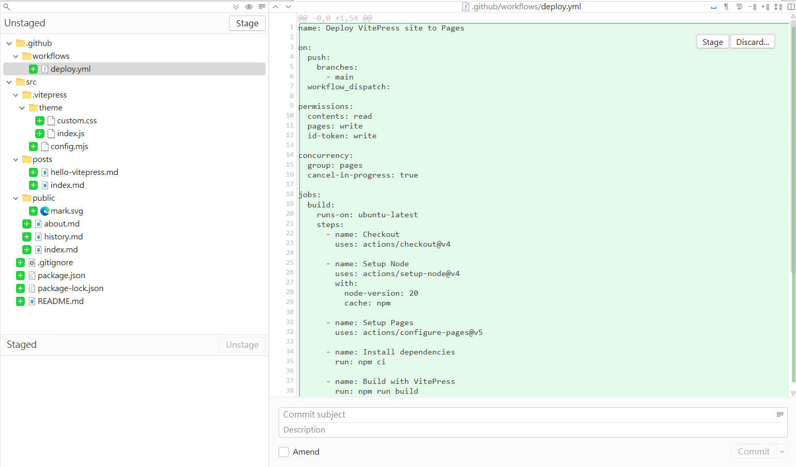
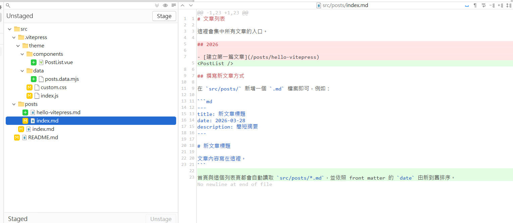

# 關於這個網站

這是一個以 VitePress 建立的靜態 Blog MVP。

目前版本專注在三件事：

1. 用 Markdown 寫文章。
2. 用 VitePress 進行靜態編譯與渲染。
3. 用 GitHub Pages 發佈成可公開瀏覽的網站。

未來可以再加上：

1. 文章分類與標籤。
2. SEO metadata。
3. 留言系統。
4. 全文搜尋。

## 歷史紀錄

本網站為我與AI共同協助創立，在此紀錄一些我在架設這個站台的一些過程。

### 2026/03/28 -1

今天開始架設網站，這是我第一次知道有 vitepress 這個東西，所幸在 AI 的幫助下，還是很快就把網站的骨架架設完成，身為工程師的我呢，唯一的工作就是去審視 AI 到底生成了些什麼內容。

因此我會透過世界上最偉大的發明之一：git，來查看 AI 的生成內容。

可以看到，git 很清楚的呈現出 AI 生成了哪些檔案：

- .github/workflows/deploy.yml
    - 這是跟 github 自動部署有關的設定檔案，也就是說因為我的內容要部署在github pages 上面，所以才會有這個檔案。

- src/.vitepress
    - 這是關於 vitepress 編譯的設定檔，裡面有 `.css` 負責畫面的呈現樣式效果、`index.js` 則是所謂的網頁腳本，也就是運行程式的地方、`config.mjs` 看起來是 vitepress 專用的頁面佈局的設定檔，用 `json` 語法去撰寫。

### 2026/03/28 -2

把`最新文章`區塊改成程式自己讀取 `posts` 資料夾並進行渲染。
